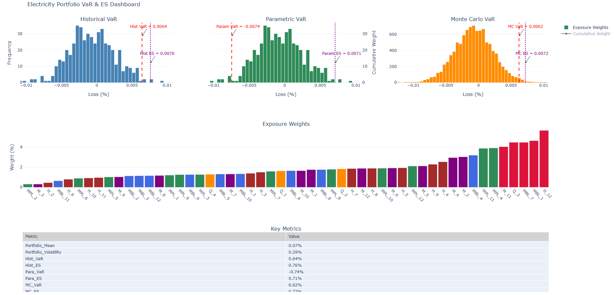
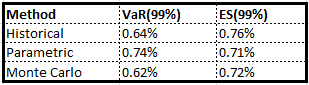
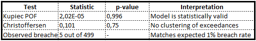

# VaR-ES-for-Electricity-Trading

# Project Aim
This project builds a production-grade risk analytics framework for electricity trading portfolios. It computes Value-at-Risk (VaR) and Expected Shortfall (ES) using historical, parametric (EWMA), and Monte Carlo methods. The system integrates market data, exposure-based weighting, backtesting, stress testing, and interactive dashboarding. Thus, delivering a robust, transparent, and scalable solution for portfolio risk assessment.
[Full technical documentation (PDF)](docs/VaR_and_ES.pdf)

# Executive Summary
* This portfolio demonstrates strong statistical reliability, with consistent VaR estimates accross methodologies and robust backtesting results.
* Daily expected return is modestly positive, while volatility remains low, indicating a stable risk-return profile.
* Stress testing reveals sensitivity to correlation shocks, suggesting potential vulnerability under systemic market conditions.
* Exposure distribution is well-balanced, with no excessive concentration in individual instruments.

# Portfolio Risk Profile
## Return and Volatility
* Daily expected return: 0:067%
* Daily volatility: 0.29%
* These figures suggest a low-risk portfolio with modest return generation, suitable for capital preservation strategies.
## VaR and ES

* All three methodologies yield consistent results, reinforcing confidence in the model calibration.
* ES values exceed VaR, as expected, and remain within a narrow band accross methods.

# Model Validation
## Backtesting Results

* The model passes both the Kupiec and Christoffersen tests, indicating accurate coverage and independence of breaches.
* No evidence of autocorrelation  or regime shifts in risk behaviour.

## Stress Testing
## Volatility Stress (x2)
* Portfolio volatility increases from 0.29% to 0.58%
* Linear scaling confirms proportional sensitivity to volatility shocks.

## Correlation Stress (+0.2)
* Volatility rises to 0.92%, more than triple the base level.
* Indicates latent concentration risk and exposure to systemic co-movement.

# Exposure Structure

* No single instrument exceeds 5% of total exposure.
* Distribution is well-balanced accross Monthly Baseload and Monthly Peakload.
* Top 3 exposures account for ~13% of portfolio, within acceptable diversification thresholds.
The portfolio avoids excessive concentration and maintains healthy exposure dispersion.

# Strategic Implications
* Risk model is validated: consistent VaR estimates and strong backtesting performance.
* Portfolio volatility is low: suitable for conservative strategies.
* Stress sensitivity is asymmetric: correlation shocks pose greater risk than volatility alone.
* Exposure structure is sound: no immediate need for rebalancing.

# Optimization
1. Integrate currency VaR: express risk in monetary terms for executive reporting.
2. Scenario testing: simulate market events(e.g demand shocks, price spikes).
3. Optimize weights: explore risk-adjusted return strategies or stess-resilient allocations.

## Implementation
* Language: Python
* Core stack: NumPy, pandas, SciPy, plotly
* Design: Modular, fully reproducible pipeline
* Focus: Transparency over black-box optimization

